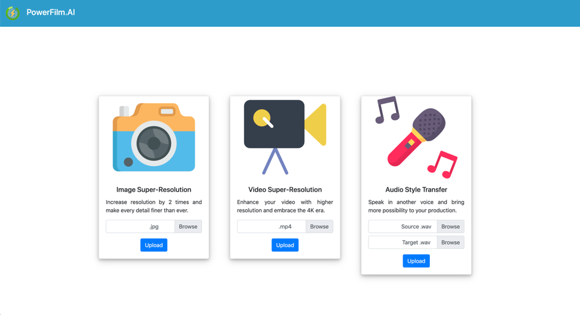
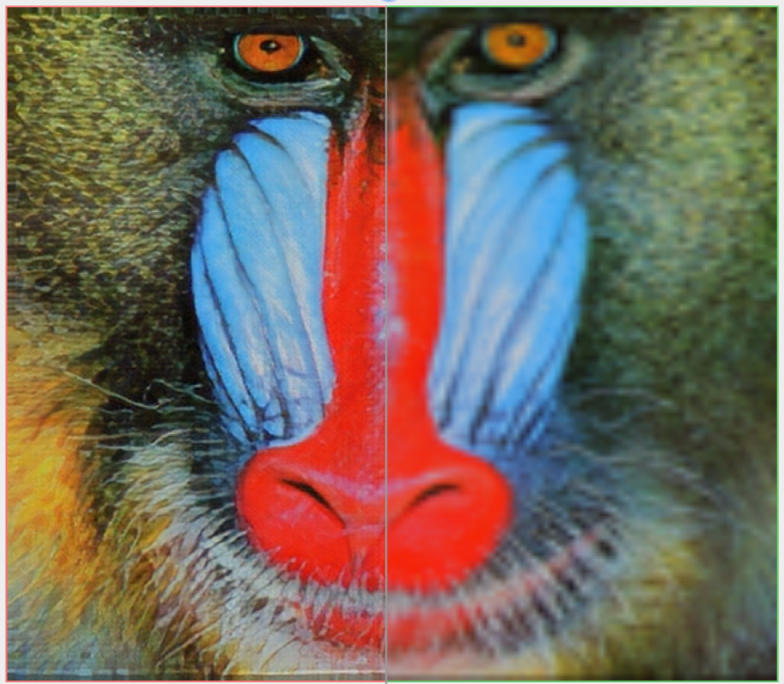

# PowerFilm.AI  

download model weights at https://drive.google.com/open?id=1Qu-NSrc6j2Bs9Lt38xIZGEs6_EzlaVxi  

## Inspiration
**4K era** is coming with an expected astounding capital annual growth rate of **25%** for the next 5 years and the entertaining industry is experiencing a lucrative revenue of more than **3 trillion dollars**. Our product, **Powerfilm.ai** is a premier product that goes in sync with the current technology development. There is just a huge potential with our Powerfilm.ai as both an entertainment and a professional editing software.
## Overview
  

Powerfilm.ai has three main functions: audio style transfer, video super resolution, and image super resolution. With a single webpage, you have the abilities to make perfect videos and images that align with the current 4K technology and transform your voices with ease. This can greatly assist the general public in multiple ways that others cannot imagine before:  

   -	Produce perfect video and photo with 4K resolutions from less-than-ideal qualities   
      

   -	Make attractive videos with unprofessional equipment and attract much more viewers on different personal platforms such as YouTube and Blogs  
     
   -	Add surprising features to your own voices for entertaining purposes  
   -	Provide production features for professions, protective features for high-profile personnel, and entertaining features within friends and family members  

### Powerfilm.ai has a lot of advantages such as:
-	Big money saver for people without professional equipment
-	Boost revenue for bloggers and YouTubers in assisting them with perfect videos
-	Fully utilize the 4K technology with video improvement services
-	Much more fun provided for general public


## Features  

### Image & Video Super Resolution
Help to enhance the resolution of an imaging system to produce a much clearer image and video in a short period of time and gives people more power to produce make their best videos.

### Audio Style Transformation
Gives people to transform original audios to audios of other kinds, which can be used in different areas such as entertainment features for communications between friends, personal privacy protection, and even for after-effects edition in a professional video editing service.


## Difficulty faced

We met some issues in file format convertion and we managed to fixed them.

## Technology used

### Python Library
```Python
Alertify
JQuery
Bootstrap
Fontawesome
Flask
PyTorch
TensorFlow
Keras
ISR
wavenet_vocoder
sk-video
FFMPEG
Librosa
scikit-image
Numpy
```

### Deep Learning Model

Residual Dense Net -- Image Super Resolution  
SRGAN -- Video Super Resolution  
Auto-VC -- Audio Style Transfer  
## Future Works


## Keywords  
```HTML, Tensorflow, Scikit-Learn, Flask, Python, Neural Networks, Machine Learning, Style Transfer, Super Resolution```
## Reference

[Residual Dense Network for Image Super-Resolution](https://arxiv.org/pdf/1802.08797.pdf)  

[Photo-Realistic Single Image Super-Resolution Using a Generative Adversarial
Network
](https://arxiv.org/pdf/1609.04802.pdf)  

[AUTOVC: Zero-Shot Voice Style Transfer with Only Autoencoder Loss](https://arxiv.org/pdf/1905.05879.pdf)
